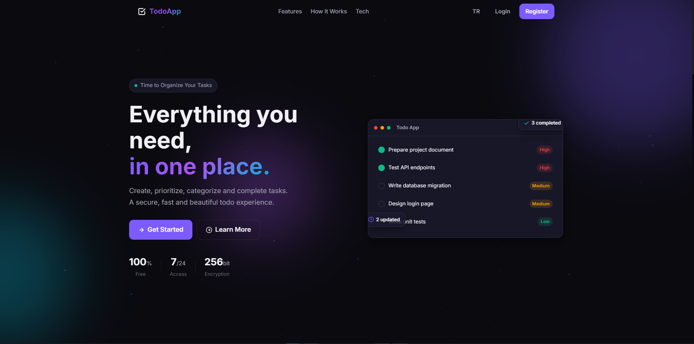
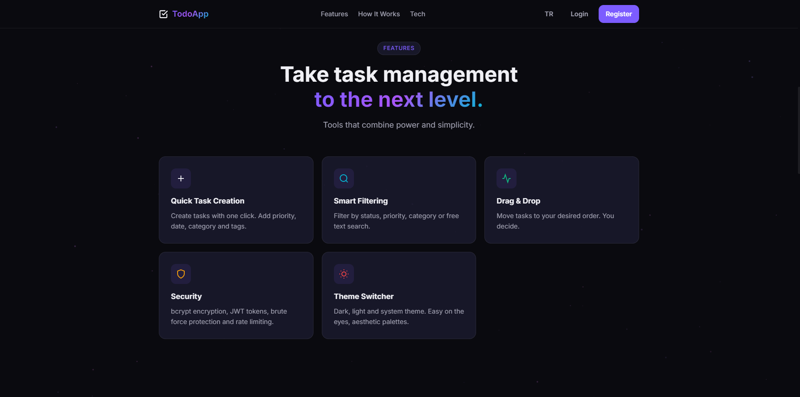
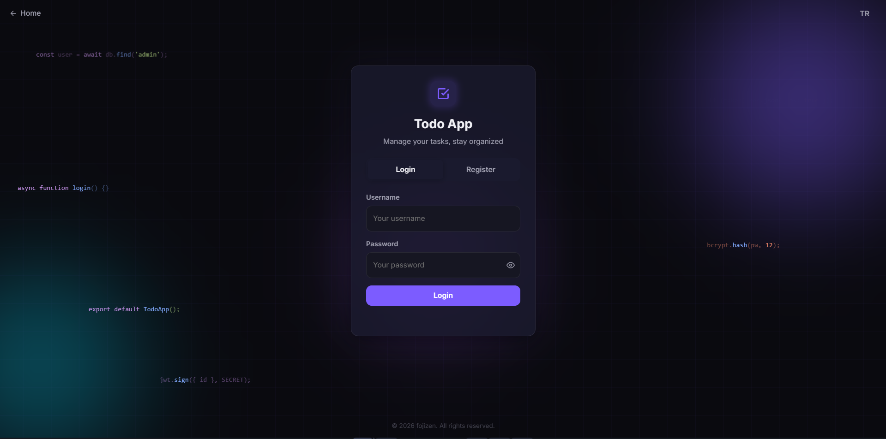
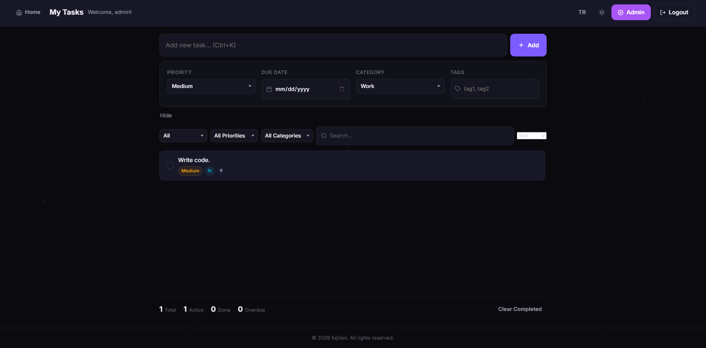

<p align="center">
  
  
  
  
  
  
</p>

<h1 align="center">Todo App</h1>

<p align="center">
  Modern, guvenli ve estetik bir gorev yonetimi uygulamasi.<br>
  Vanilla JS frontend + Express.js backend + PostgreSQL veritabani.
</p>

<p align="center">
  <a href="https://fojizen-todo-app.onrender.com" target="_blank">Canli Demo</a> &bull;
  <a href="#ozellikler">Ozellikler</a> &bull;
  <a href="#kurulum">Kurulum</a> &bull;
  <a href="#api-referansi">API</a> &bull;
  <a href="#cevresel-degiskenler">Ortam Degiskenleri</a>
</p>

---

## Ekran Goruntuleri

> Asagidaki goruntuleri kendi screenshot'larinizla degistirin.
> `screenshots/` klasorune PNG/JPG olarak yukleyin.

### Landing Page
<p align="center">
  
</p>

### Ozellikler
<p align="center">
  
</p>

### Login / Register
<p align="center">
  
</p>

### Gorev Yonetimi
<p align="center">
  
</p>

---

## Ozellikler

### Gorev Yonetimi
- Gorev ekleme, duzenleme, silme
- Gorev durumu degistirme (checkbox)
- Oncelik belirleme: Dusuk, Orta, Yuksek
- Bitis tarihi ekleme (gecikmis gorevler kirmizi ile isaretlenir)
- Kategoriler: Is, Kisisel, Alisveris, Saglik, Egitim
- Etiket sistemi (virgulle ayrilmis)
- Surukle & birak ile siralama
- Filtreleme: durum, oncelik, kategori, arama
- Siralama: tarih, oncelik, olusturma, siralamaya gore
- Tamamlanan gorevleri toplu silme
- Gorev sayisi ve istatistikleri

### Kullanici Sistemi
- Kayit olma (kullanici adi musaitlik kontrolu, e-posta dogrulama)
- Giris yapma (buton spinner + tik animasyonu)
- Oturum yonetimi (JWT, httpOnly cookie, 7 gun sure)
- Guvenli sifre depolama (bcrypt, 12 rounds, async)
- Sayfa yenileme durumunda son sayfayi hatirlama

### Tasarim & Tema
- Koyu / Acik / Sistem temasi
- Partikul animasyonlu arka plan (Canvas API)
- Login sayfasinda animasyonlu orb, grid ve kod snippet'leri
- Glassmorphism efektleri
- Modern loader animasyonu (donen glow halka)
- Responsive tasarim (mobil, tablet, desktop, TV)
- Zoom uyumlu layout
- TR / EN dil destegi
- Sayfa gecis animasyonlari
- Gelistirilmis secenekler paneli (modern select, date picker, tag input)
- Footer sosyal medya baglantilari (GitHub, LinkedIn, Instagram, Portfolio)

### Guvenlik
- Rate limiting (login: 15/dk, register: 10/15dk, gorev CRUD: 30/dk)
- Brute force korumasi (5 basarisiz giris → 15 dk kilit)
- Guvenlik headerlari: HSTS, CSP, X-Content-Type-Options, X-Frame-Options: DENY, X-XSS-Protection, Referrer-Policy, Permissions-Policy
- CORS sinirlamasi (sadece izin verilen origin'ler)
- JWT token ile yetkilendirme (httpOnly cookie, 7 gun sure)
- Girdi dogrulama (tip, uzunluk, regex, 500 karakter siniri)
- XSS korumasi (HTML encoding, attribute escaping)
- SQL injection korumasi (prepared statements)
- Double-submit onleme (POST-only, 1s cooldown)
- Race condition onleme (ON CONFLICT)

---

## Teknolojiler

| Katman | Teknoloji |
|--------|-----------|
| Frontend | Vanilla HTML5, CSS3, JavaScript (ES5+) |
| Backend | Express.js 5.x |
| Veritabani | PostgreSQL (Supabase) |
| Kimlik Dogrulama | JWT (jsonwebtoken) + httpOnly cookie |
| Sifreleme | bcryptjs (async) |
| Cookie | cookie-parser |
| Styling | Custom CSS (CSS Variables, Glassmorphism, Animasyonlar) |
| Animasyonlar | Canvas API (partikuller), CSS Animasyonlar |
| Deployment | OnRender (backend) + GitHub Pages |

---

## Kurulum

### On kosullar
- [Node.js](https://nodejs.org/) 18+ (test edilmis: 24.x)
- npm
- PostgreSQL veritabani (Supabase veya yerel)

### Adimlar

```bash
# Repositoryi klonla
git clone https://github.com/fojizen/todo-app.git
cd todo-app

# Bagimliliklari yukle
npm install

# Ortam degiskenlerini ayarla
cp .env.example .env
# .env dosyasini duzenle

# Serveri baslat
node server.js
```

Sunucu varsayilan olarak `http://localhost:3000` adresinde baslar.

---

## Proje Yapisi

```
todo-app/
├── server.js          # Express backend, API rotalari, DB yardimcilari
├── app.js             # Frontend JavaScript (IIFE, API, UI)
├── index.html         # Ana HTML sayfasi (landing, login, main, modallar)
├── styles.css         # CSS stilleri (tema, responsive, animasyonlar)
├── package.json       # Bagimliliklar ve scriptler
├── favicon.svg        # SVG favicon (mor tik ikonu)
├── favicon.ico        # ICO favicon (arama motorlari icin)
├── apple-touch-icon.png # Apple mobil favicon
├── sitemap.xml        # Sitemap (arama motorlari icin)
├── screenshots/       # Ekran goruntuleri (GitHub icin)
│   ├── homepage.png
│   ├── features.png
│   ├── login.png
│   └── MyTasks.png
└── data/
    └── .jwt_secret    # JWT anahtari (uretimde env var ile degistirilir)
```

---

## API Referansi

Tum API istekleri `/api` on ekini gerektirir.

### Kimlik Dogrulama

| Method | Endpoint | Aciklama |
|--------|----------|----------|
| `POST` | `/api/login` | Giris yapma (cookie ile token doner) |
| `POST` | `/api/register` | Kayit olma (cookie ile token doner) |
| `POST` | `/api/logout` | Cikis yapma (cookie temizlenir) |
| `GET` | `/api/check-username/:username` | Kullanici adi musaitlik kontrolu |
| `GET` | `/api/me` | Mevcut kullanici bilgisi (token gerekli) |

### Gorevler (token gerekli)

| Method | Endpoint | Aciklama |
|--------|----------|----------|
| `GET` | `/api/tasks` | Tum gorevleri listele |
| `POST` | `/api/tasks` | Yeni gorev olustur |
| `PUT` | `/api/tasks/:id` | Gorevi guncelle |
| `DELETE` | `/api/tasks/:id` | Gorevi sil |
| `PUT` | `/api/tasks/reorder` | Gorevleri yeniden sirala |

---

## Cevresel Degiskenler

| Degisken | Aciklama | Zorunlu |
|----------|----------|---------|
| `PORT` | Sunucu portu | Hayir (varsayilan: 3000) |
| `DATABASE_URL` | PostgreSQL connection string | Evet |
| `JWT_SECRET` | JWT imza anahtari (minimum 64 karakter) | Evet |
| `ADMIN_PASSWORD` | Admin sifresi | Evet |
| `FRONTEND_URL` | Frontend URL'si (CORS icin) | Hayir (varsayilan: localhost:3000) |
| `NODE_ENV` | Ortam (`production` / `development`) | Hayir (varsayilan: development) |

---

## Veritabani

### users

| Kolon | Tip | Aciklama |
|-------|-----|----------|
| id | SERIAL | Anahtar, otomatik artan |
| username | TEXT | Benzersiz kullanici adi |
| email | TEXT | E-posta adresi |
| passwordhash | TEXT | bcrypt ile hashlenmis sifre |
| role | TEXT | Kullanici rolu |
| banned | BOOLEAN | `true`: banli, `false`: aktif |
| lastlogin | TEXT | Son giris tarihi |
| createdat | TEXT | Kayit tarihi |

### tasks

| Kolon | Tip | Aciklama |
|-------|-----|----------|
| id | SERIAL | Anahtar, otomatik artan |
| userid | INTEGER | Kullanici ID (FK → users.id) |
| text | TEXT | Gorev metni (maks 500 karakter) |
| done | BOOLEAN | `true`: tamamlandi, `false`: bekliyor |
| priority | TEXT | `low`, `medium`, `high` |
| duedate | TEXT | Bitis tarihi (YYYY-MM-DD) |
| category | TEXT | Kategori adi |
| tags | TEXT | JSON array olarak etiketler |
| itemorder | INTEGER | Siralama degeri |
| createdat | TEXT | Olusturma tarihi |
| updatedat | TEXT | Guncelleme tarihi |

### login_attempts (brute force korumasi)

| Kolon | Tip | Aciklama |
|-------|-----|----------|
| id | SERIAL | Anahtar |
| username | TEXT | Kullanici adi |
| ip | TEXT | IP adresi |
| success | BOOLEAN | Basarili giris mi |
| createdat | TEXT | Deneme tarihi |

---

## Guvenlik

- **Sifreleme:** bcrypt (12 rounds) ile sifre hashleme (async)
- **Token:** JWT 7 gun sure, HS256 imza, httpOnly cookie
- **Rate Limiting:** IP bazli istek sinirlamasi (login, register, gorev CRUD)
- **Brute Force:** 5 basarisiz giris denemesinden sonra 15 dakika kilit
- **Header'lar:** HSTS, CSP, Clickjacking, MIME sniffing, XSS korumasi
- **CORS:** Sadece izin verilen origin'ler
- **Girdi Dogrulama:** Sunucu tarafinda tip, uzunluk ve format kontrolu
- **Prepared Statements:** SQL injection onleme
- **HTML Encoding:** XSS onleme icin cikti temizleme
- **Double-Submit Onleme:** POST-only, 1 saniye cooldown
- **Race Condition Onleme:** ON CONFLICT ile ayni anda coklu istek korumasi

---

## SEO & Deploy

- **Meta etiketleri:** title, description, og:image, og:url, og:site_name, canonical
- **JSON-LD:** Person + WebSite structured data
- **Sitemap:** `/sitemap.xml` (arama motorlari icin)
- **Favicon:** SVG (tarayicilar), ICO (arama motorlari), Apple Touch Icon (mobil)
- **Google Site Verification:** `0GoTL9hCgwktaTNu2t-vsFf9aqm-kxb9xwoGWEwZyS0`
- **OnRender:** Backend deploy (uyku onlemeli ping)
- **UptimeRobot:** 5 dakikada ping (OnRender uyumasini onler)

---

## Iletisim

- **GitHub:** [github.com/fojizen](https://github.com/fojizen)
- **LinkedIn:** [linkedin.com/in/fojizen](https://www.linkedin.com/in/fojizen/)
- **Instagram:** [instagram.com/fojizen](https://www.instagram.com/fojizen/)
- **Portfolio:** [fojizen.vercel.app](https://fojizen.vercel.app)

---

## Lisans

MIT License. Detaylar icin [LICENSE](LICENSE) dosyasina bakin.

<p align="center">
  <sub>&copy; 2026 fojizen. Tum haklari saklidir.</sub>
</p>
